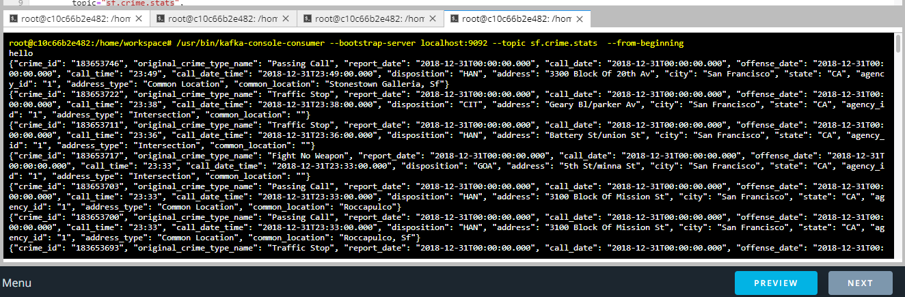
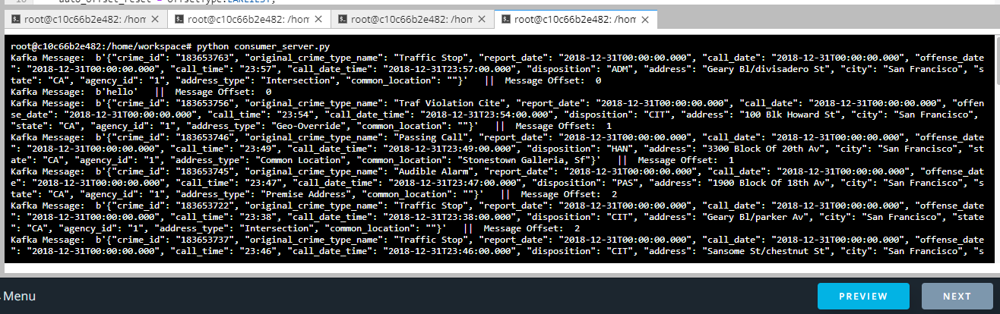
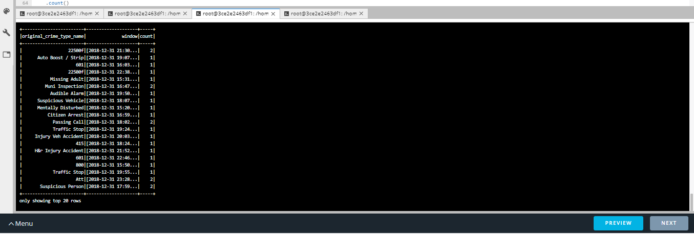
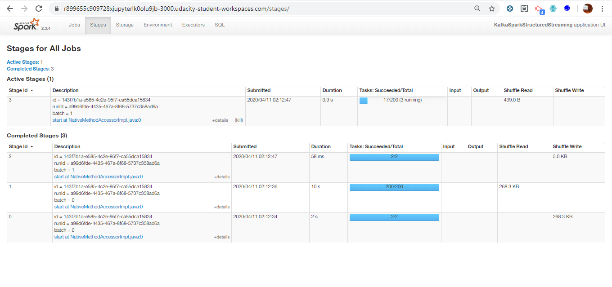

# Udacity Data Streaming using Spark Structured Streaming
Includes the analysis of the San Francisco Crime Data using Spark streaming and kafka

## Deliveries
- kafka_server.py: Includes the code required to intialize a kafka producer and send the data to the designated kafka topic
- producer_server.py : Includes our producer class
- consumer_server.py : Develoepd consumer to consume data from the topic containg San Francisco crime data.
- data_stream.py : Contains the code for spark streaming

## Flow

First of all, Zookeeper server was started and the kafka broker. After that the kafka_server.py file was executed and records were produced to the kafka topic. Through Kafka CLI kafka-console-consumer, the records were consumed for validation

Then another consumption way through consumer_server.py

After finalinzing the code of spark structured streaming and executing the script, the results were as follows:

and below attached an image from the spark UI

## Optimization Discussion

### How did changing values on the SparkSession property parameters affect the throughput and latency of the data?

- Changing the number of records per trigger highly affect the latency, large numbers can load spark and cause backlog, low values can cause some sort of starvation and wasting of time. This parameter should be adjusted well to get the best possible performance

- Executor memory : Executor memory, impacts the sizing of the data handled by the execuotr and the spill to disk

- Executor cores : The number of cores per each executor

- mum executors : Increases parallelism

### What were the 2-3 most efficient SparkSession property key/value pairs? Through testing multiple variations on values, how can you tell these were the most optimal?

- maxOffsetPerTrigger : 400
- spark.streaming.kafka.maxRatePerPartition : 50

This is can be sensed easilt through time taken to process a batch
